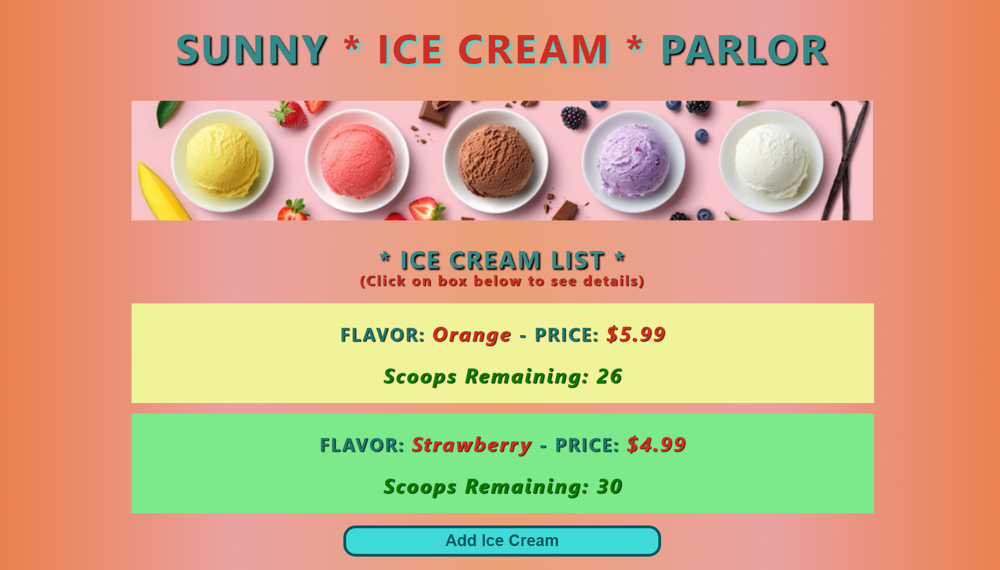
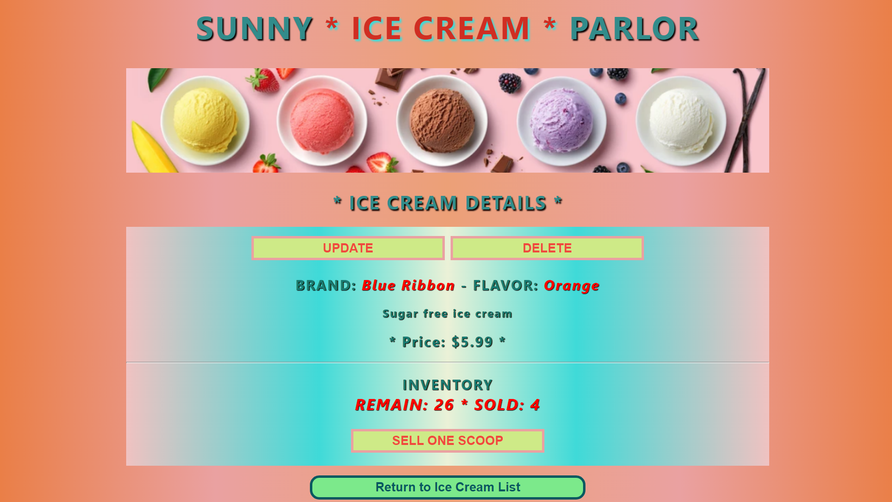

# Sunny Ice Cream Parlor (React Project)

#### By Sue Roberts

####  React application for ice cream shop inventory that tracks the number of scoops they sell.

## App Diagram

## Technologies Used

* React
* JavaScript
* HTML
* CSS

## Description

When a user runs this application, they are able to track the scoops of the ice cream they sell and see a detailed list of all available flavors of ice creams. Users are able to add, delete, edit and see remaining scoops of ice creams.

## Project Images

## Setup/Installation Requirements

* Clone repository: $ git clone https://github.com/SueRtx/ice-cream-parlor.git    
* Navigate to "ice-cream-parlor": $ cd ice-cream-parlor   
* Open Vs Code: $ code .   
* Open TERMINAL in Vs Code
* Install dependencies: $ npm install
* Run Program: Go to terminal  → $ npm start run 
* Open web browser: http://localhost:3000/ (if web page does not open automatically) 

## Known Bugs

* none

## License

MIT

Copyright (c) 2022 Sue Roberts
